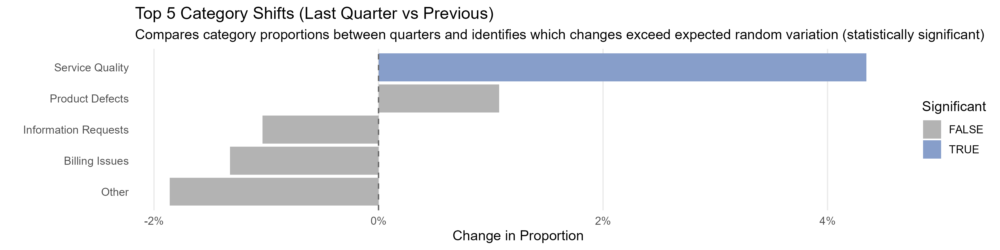
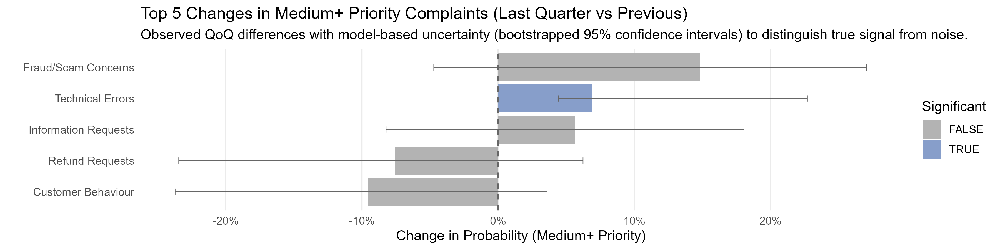

## Quarterly Complaint Analysis Pipeline

### Overview

This project demonstrates an end-to-end R pipeline for analysing quarterly changes in customer complaint data. It is designed to address a common problem in business intelligence:

**In low-volume datasets with many categories, apparent trends are often driven by random variation rather than real change.**

The pipeline combines statistical testing and model-based estimation to distinguish meaningful shifts from noise, helping teams focus on changes that matter and move away from over-interpretation of small changes and reactive decision-making.

## Pipeline Structure

### `pipeline.R`
- Entry point for the workflow  
- Determines the current reporting quarter  
- Prevents duplicate runs  
- Locates and standardises the input file  
- Triggers the analysis script  
- Writes logs  

### `quarterly_analysis.R`

**Data Processing**
- Parses and validates input data  
- Applies basic data quality checks  
- Filters to the two most recent completed quarters  
- Prepares category and priority fields  

**Analysis 1 – Category Distribution**
- Compares category proportions between quarters  
- Uses chi-square testing and effect size  
- Calculates per-category changes with confidence intervals  

**Analysis 2 – Priority Shift Modelling**
- Models changes in complaint priority (Low / Medium / High)  
- Uses ordinal logistic regression  
- Applies bootstrap estimation  
- Identifies meaningful changes in higher-priority complaints  


## Output
The pipeline produces two datasets:
- Category distribution changes  
- Priority shift (model-based and observed)

These outputs are designed to be consumed directly by reporting tools.


## Integration with Reporting

The pipeline is designed to integrate upstream of any analytics or reporting platform.

It can:
- run independently (e.g. scheduled via a VM or task scheduler)
- run within a platform (e.g. Microsoft Fabric)

Outputs are written as simple CSV files, allowing downstream tools (Power BI, Tableau, etc.) to pick them up for visualisation without transformation.


## Example Dataset

The included dataset is synthetic and designed to mimic real-world complaint data:

- ~5000 records  
- 20 categories (including some low-frequency categories)  
- Uneven distribution across categories  
- Subtle shifts between quarters  

It also includes small data quality issues (e.g. missing values, future-dated record) to demonstrate robustness.

## Example Interpretation

The charts below have been created using the output data from this pipeline and illustrate how observed changes can differ from statistically meaningful changes.

### Category Shifts



- Some categories change slightly quarter-to-quarter, but most differences fall within expected random variation.  
- Only **Service Quality** shows a statistically significant increase, suggesting a genuine shift in the underlying category mix.  
- Other movements (e.g. **Billing Issues** or **Information Requests**) may appear notable but are likely noise.

### Priority Shifts (Medium+ Complaints)



- Several categories show increases in higher-priority complaints (e.g. **Fraud/Scam Concerns**).  
- However, large confidence intervals indicate high uncertainty, meaning the statistical model indicates that they are likely due to natural fluctuation.  
- Only **Technical Errors** shows a statistically meaningful increase in medium+ priority complaints.


### Key Takeaway

Not all observed changes are meaningful. This approach helps distinguish **real shifts** that warrant investigation from **random variation** that should not drive decisions  

By combining observed data with model-based uncertainty, the pipeline reduces the risk of overinterpreting noise in low-volume, multi-category datasets.

## Running the Pipeline

1. Clone the repository  
2. Ensure your working directory is the project root  
3. Ensure a dataset exists at `data/input_data.csv`  
4. Run:

```r
source("scripts/pipeline.R")
```

## Dependencies
Packages dplyr, tidyr & MASS

## Key insight
This project demonstrates how statistical methods can be integrated into routine reporting to:

- reduce false positive trends
- highlight genuinely meaningful changes
- improve the quality of business decisions
